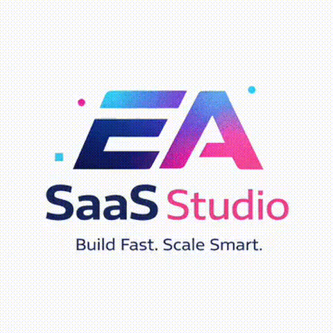
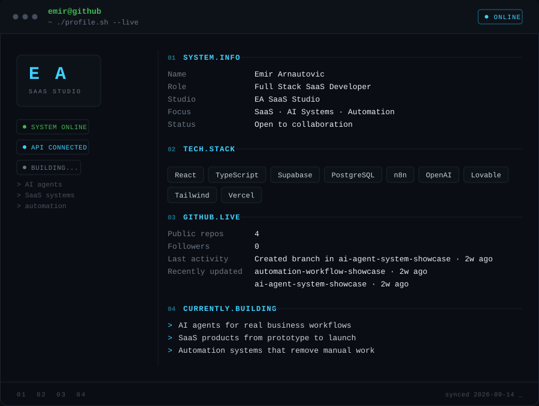

 

<code>$ emir@github ~ ./profile.sh --live</code>

 
 

 

## 01 / SaaS Products

**Prototype → Production**

`React` `TypeScript` `Supabase` `PostgreSQL`

I build launch-ready SaaS products with authentication, databases, payments and scalable backend logic.

---

## 02 / AI Systems

**Business Workflows → AI**

`OpenAI` `AI Agents` `Voice AI` `APIs`

AI assistants, chat and voice agents connected to real business processes, company data and existing tools.

---

## 03 / Automation

**Manual Work → Automated**

`n8n` `APIs` `CRM` `Integrations`

Automated systems for lead generation, qualification, outreach, notifications and internal business workflows.

---

### Have something worth building?

From a rough idea, an existing product that needs fixing,  
or a workflow that should no longer be manual.

**Let's turn it into a working product.**

[**EA SaaS Studio →**](https://easaas.studio)

Open to selected freelance projects & collaborations.

